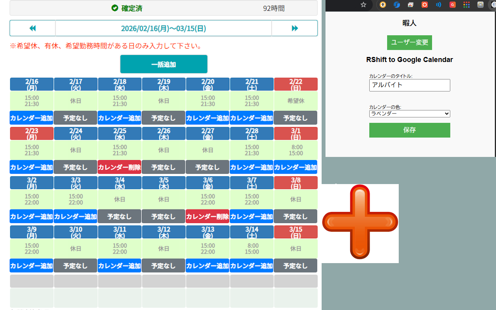

# 📅 RShift Calendar Sync
**Shift Management Chrome Extension**


アルバイト管理サイト「RShift」のシフト表を解析し、Googleカレンダーへワンクリックで同期するChrome拡張機能です。
手動入力の手間を削減し、シフトの二重登録や入力ミスを防ぎ、一括で登録する機能による効率化を目指して開発しました。

## ✨ Main Function

* **⚡️ Smart Sync:**
    * HTMLテーブルから日付・時間を正規表現を用いて高精度に抽出。
    * `&nbsp;` などの不要な文字コードを自動クリーニングし、データの堅牢性を確保。
* **🔄 Bulk Sync Function:**
    * ページ内の確定済みシフトを検出し、全件まとめてカレンダーに登録。
    * **技術的特筆点:** `Promise.allSettled` を使用し、一部のAPI通信が失敗しても全体の処理を止めない堅牢な設計。
* **🛡 Duplication Prevention:**
    * ブラウザのローカルストレージ（`chrome.storage.local`）をデータベースとして活用し、登録済みのイベントIDを管理。
    * 二重登録を防止し、登録済みシフトは「削除」ボタンに自動で切り替え。
    * カレンダーのタイトルやカラーを保存することで、Google Calendar上のUIを向上。

## 🔀 Production Process
### 🖼️ Background

友人が半月/一月ごとにアルバイトのシフトをGoogle Calendarに同期させる際に15~30回同じ作業をしており、以下のような課題を生んでいました。

* 転記ミスによるシフトの勘違いや遅刻のリスク

* 毎月のシフト更新のたびに発生する、煩雑で無駄な作業時間

### 🎯 Purpose
本プロダクトは、上記のような「日常業務における小さな非効率」を排除し、ユーザーが利用中のプラットフォーム（ブラウザ）上でシームレスに完結する自動化を提供することを目的としました。ITリテラシーに関わらず、誰でもボタン一つ（または一括）でミスなくカレンダー連携ができる状態を目指しています。

### 🛠️ Technical Stack

ユーザーの既存のワークフローを崩さず、最も導入障壁が低い形を実現するため、以下の技術スタックを選定しました。

* プラットフォーム：Chrome Extension (Manifest V3)

  * 意図: ユーザーに新しいアプリのインストールや、別サイトへの画面遷移を強いることなく、普段利用しているRShiftのWebページ上に直接UIを拡張（DOM操作）できる点が最大のメリットと考え、採用。

* フロントエンド：Vanilla JavaScript (ES6+), HTML, CSS

  * 意図: DOM解析とAPI通信が主たる機能であるため、React等のフレームワークによるオーバーヘッドを避け、軽量かつ高速に動作させるために素のJavaScriptを採用しました。

* 認証・API：Google OAuth 2.0 (chrome.identity), Google Calendar API

  * 意図: ユーザーの機密情報（カレンダー情報）を安全に扱うため、公式のOAuthフローを実装することで、サードパーティ製ツールとしてのセキュリティと信頼性を担保しています。

* 状態管理：chrome.storage.local

  * 意図: カレンダーへ追加済みのシフト（Event ID）をローカルに保持し、UI上で「追加済み（削除可能）」の状態を復元できるようにしました。これにより、重複登録を防止し、直感的なデータ管理を実現しています。さらに、カレンダーの色やタイトルを保持することで、ユーザーごとに設定可能な項目を増やすことにしました。

## 💡 Technical Insights

### 1. Unsynchronized State & Race Condition
初期の実装では、複数のボタンを連続で押した際にボタンの表示状態（登録中→完了）が不整合を起こす「レースコンディション」が発生していました。
これを解決するため、ボタンの状態遷移（Loading, Success, Failed）を管理する関数 `updateButtonState` を実装し、DOM要素の参照を動的に更新することで、UIの整合性を完全に保つ設計にリファクタリングしました。

### 2.  Google Calendar API
APIのリクエスト制限やネットワークエラーを考慮し、一括登録機能では並列処理とその結果の集約（Settled）を採用。成功数と失敗数を正確にフィードバックするUXを実現しました。

### 3. Security & Privacy
Googleの「Limited Use Policy」に準拠し、取得したデータはユーザーのブラウザ内とGoogle API間のみで通信。外部サーバーへのデータ送信を行わない「クライアントサイド完結型」のアーキテクチャを採用しています。

## Key Features

### 1. Unsynchronized State & Race Condition
  * API通信中（addingやdeletingステータス時）はボタンを非活性化し、ユーザーの連続クリックによる意図しない重複リクエストを防ぐ堅牢な作りにしています。

### 2. Bulk Add Function
  * 今月のシフトを一括でカレンダーへ登録する機能を実装しました。

### 3. Scalability & Maintainability
  * 初期段階からchrome.i18nを用いた国際化対応を行っています。

### 4. Public Release
  * 本プロダクトはGoogleの公式OAuth審査を通過し、プライバシーポリシーを策定した上でChrome Web Storeにて一般公開しており、実際の運用フェーズまで経験しています。

### 5. Update & Bug Fixes
  * アカウントが複数ある場合でも、切り替えが可能になりました。
  * `Event Id`を保存するようにし、重複登録を防止するようにし、削除ボタンを実装しました。
  * RshiftのサイトのUIに合わせて、ボタンのデザインを変更しました。
  * 2025年12月15日~2026年1月14日のような年をまたぐシフトの際、2025年の1月に入ってしまうバグを修正。

## 🚀 How to Install (For Developers)

1.  Clone this repository.
    ```bash
    git clone [https://github.com/ponchannnn/rshift-calendar-sync.git](https://github.com/ponchannnn/rshift-calendar-sync.git)
    ```
2.  Open Chrome and navigate to `chrome://extensions/`.
3.  Enable **Developer mode**.
4.  Click **Load unpacked** and select the directory.

## 📷 Screenshots

| シフト一覧画面 |
|:---:|
|  |
## 👤 Author
* **ponCHANNN**